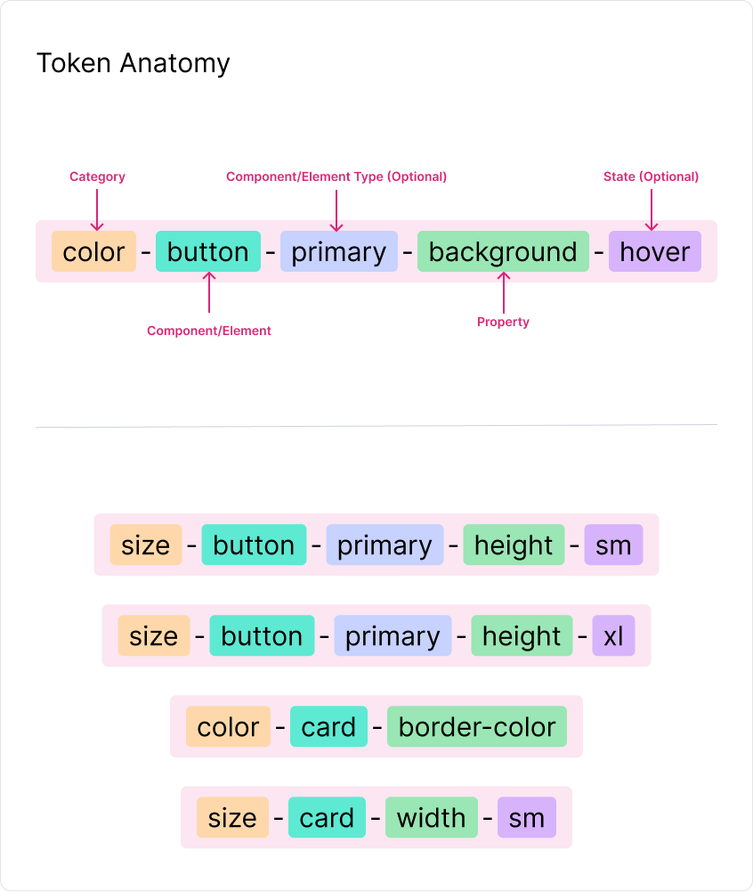

# Theme

## Overview

The `Theme` folder contains all theme-related packages for our workspace. Each package is meticulously structured to facilitate the implementation and management of design systems across projects.
This includes defining design tokens and variables, and setting up CSS and SCSS implementations.

## Token Anatomy



## Add new theme
- Create a new theme library
- Copy Json token
- Run parser to generate scss tokens
- Make sure the following paths are updated correctly
  - `tsconfig.storybook-manager-paths.json`
  - `tsconfig.base.json`
- Update `CCK_THEMES_MAP` from `packages/internal/storybook-theme-switcher/src/lib/config/cck-theme.config.ts`
- Update `CckThemeName` and `CckThemeId` from `packages/internal/storybook-theme-switcher/src/lib/config/cck-themes.model.ts`
- Update `packages/internal/storybook-theme-switcher/src/lib/styles/themes.scss`

## Structure

Each theme package within this folder adheres to a specific folder structure, designed to streamline theme development and ensure consistency:

### Token
Located under the `token` folder, these files define non-outputting SCSS tokens like font sizes, color definitions, and more.
- `color-palette.scss`: Defines SCSS color palette variables. For example:
```sass
$color-blue-100: var(--color-blue-100)
```
- `color.scss`: Sets SCSS color aliases or brand variables.
- `gradient.scss`
- `shadows.scss`
- `typography.scss`
- `aspect-ratios.scss`
- `typography.scss`
- `easing.scss`
- `animations.scss`
- `sizes.scss`
- `borders.scss`
- `z-index.scss`
- `media-queries.scss`
- `masks.scss`

### Tools
Contains globally used mixins and functions. This section is crucial for extending our theme capabilities without generating CSS.

### Props
This includes CSS variable registrations to ensure easy theming and overrides.

**For example:**
- `color-palette.scss`: Registers colors as CSS variables within the following format that allows easy overriding.
```css
:where(html) {
    --color-blue-100: #d0ebff;
}
```

### Styles
Houses the actual stylesheets for basic HTML elements and utilities, ensuring base styling across applications.
- `normalize.scss`: Reset and/or normalize styles. such as `box-sizing`
- `elements.scss`: Redefines default browser styling for HTML elements. such as `h1`, `a`, etc.
- `utils.scss`: Provides utility classes for broad use across components and layouts. Such as `cck-hiden` 
- `components/`: Contains specific styles for UI components like buttons, where css selectors imports from the theme-core package. Example for `components/button.scss`:
```scss
@use '...' as *;
    
// A wrapper element for button component
.#{$button-wrapper} {
    ...
}
```

### Index and Setting Files
- `index.scss`: Exports all files from the `styles` and `props` folders for application-wide usage.
- `setting.scss`: Exports all configurations from the `token` and `tools` folders for developers to use in projects.

## Creating a New Theme Library

Utilize our workspace schematic to generate a new theme library effortlessly. This will set up the default structure and import essentials for adapting your theme. Follow these steps:

TODO: ...

## Contributing

Your contributions to maintaining and enhancing our themes are welcome. Keep the following in mind:

1. **Minimize Changes:** Limit the number of structural changes to ensure ease of maintenance and understanding.
2. **Document Changes:** Clearly document any changes or additions to the structure to keep everyone on the same page.

## Conclusion

This theme structure is designed to be intuitive and flexible, supporting both developers and designers in creating cohesive and scalable design systems. For any assistance or more detailed guidelines, refer to the main repository documentation or contact the project maintainers.

Thank you for collaborating on and enhancing our theme capabilities!
